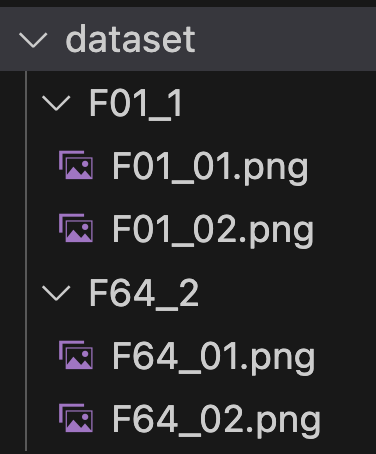

# ReNIn (<u>Re</u>laxed <u>N</u>oise2Noise and <u>In</u>put Dropout)
## environment
- Ubuntu 18.04.4 LTS
- Python 3.9.13
- Pytorch 1.12.1 (cuda 11.3)
### Conda environment setting
```bash

conda env create -f ReNIn_env.yml
conda activate ReNIn

```

## Folder information
- core
  - Code for training and testing the model
- data_preparation
  - Code for making patches from large images (2048x3072 for our images) to hdf5 files for training
- dataset
  - place the images in the dataset folder which is used for training and testing.
  - 
  - If you want to train the model with F01-F02, you should make F01, F02 folders and put the images in the folders.
    - ex) F01-F32 training -> make F01, F32 folders
    - dataset for F#1-F#2 training (the number after subscript => _1 : input, _2 : target)
      - F#1_1
        - F#1_1.png
        - F#1_2.png
        - ...
      - F#2_2
        - F#2_1.png
        - F#2_2.png
        - ...
  - The image file name should be in the format of F#_xx.png
- result_data
  - The place where the results (PSNR, SSIM) and images are saved during the training process (can be opened with scipy.io package)
- SEM_semi_log
  - The place where the tensorboard logs are saved (not necessary if you use wandb)
- wandb
  - The place where the wandb logs are saved
- weights
  - The place where the trained model's weights are saved
  - The weights are saved in the format of .w file
  - The weights are used in get_denoised_output.ipynb
## Training guideline
1. Data preparation 
   - This is the process of making patches to use for training.
   1. Make a folder with the f_number you want to train in the dataset folder and put the corresponding images in it.
      - If you want to train with F01 and F32, use the existing F01 and F32 folders, or delete the folders and create the corresponding f_number folders.
      - Put the images in the format of F01_xx.png in the folder. (If you don't want to use this format, you need to modify the code.)
      - The number of images in the two folders must be the same. (to use image-image pair)
   2. Run run_make_patch.sh in the data_preparation folder.
    - run_make_patch.sh
      - The code for making patches from large images
      - The options related to make_patch.py are in lines 15-20 of make_patch.py.
      - If you don't need to exclude top and bottom of images (256 pixels), you can comment out `python 1_crop_top_bottom.py`
      - If you don't need to perform *PSNR matching*(image registration), you can comment out `python 2_get_alignment_info.py` and `python 3_align_images.py`
   3. Run 5_validate_dataset.ipynb to check if the dataset is well made.
      - If the images show the same screen, it is well done.
2. Training
    1. Run SEM_semi_train.sh code
        - ex) ./SEM_semi_train.sh 0 F01 F64 **MSE** : Train supervised learning (F01-F64) with MSE loss function on GPU idx 0
        - The default setting is epoch 10. You can adjust it according to the loss curve.
        - If you want to use input dropout, add `--apply-RPM --RPM-p 0.6 --RPM-type random` at the end of the argument.
        - select appropriate variables and hyperparameters for below options
          - `$GPU_NUM` : idx of GPU
          - `--testidx` : test image index
          - `--apply-RPM` : apply input dropout
          - `--RPM-p` : dropout probability
          - `--RPM-type` : dropout type
          - `--nepochs` : number of epochs
          - `$BATCH_SIZE` : batch size
          - `--test` : test mode
          - `--log-off` : turn off logging with wandb
          - For more information, check the code in the `argument.py` file.
        - For ReNIn (Relaxed NoiseNoise + Input dropout),
          - `./SEM_semi_train.sh $GPU_NUM F01 F08 MSE FBI_Net $BATCH_SIZE --nepochs 10 --testidx 4 --apply-RPM --RPM-p 0.6 --RPM-type random`
        - For Noise2Noise
          - `./SEM_semi_train.sh $GPU_NUM F01 F01 MSE FBI_Net $BATCH_SIZE --nepochs 10 --testidx 4`
        - For Noise2Noise with input dropout
          - `./SEM_semi_train.sh $GPU_NUM F01 F01 MSE FBI_Net $BATCH_SIZE --nepochs 10 --testidx 4 --apply-RPM --RPM-p 0.6 --RPM-type random`
        - For supervised learning
          - `./SEM_semi_train.sh $GPU_NUM F01 F64 MSE $BATCH_SIZE --nepochs 10 --testidx 4`
        - For supervised learning with input dropout
          - `./SEM_semi_train.sh $GPU_NUM F01 F64 MSE $BATCH_SIZE --nepochs 10 --testidx 4 --apply-RPM --RPM-p 0.6 --RPM-type random`
        - Rest of baselines is in the **run_train.sh** file.
3. The evaluation results 
  - The results can be checked in the wandb page.

## Acknowledgment
- The code is based on FBI-denoiser, which is from [here](https://github.com/csm9493/FBI-Denoiser)

